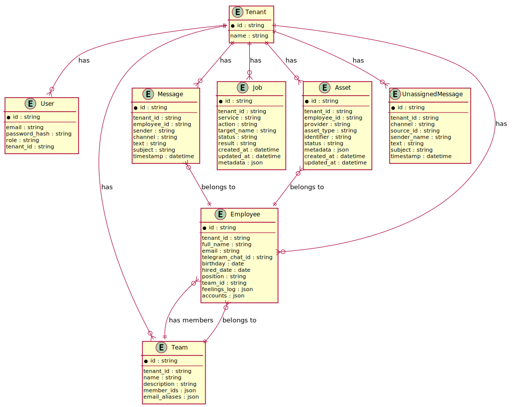

<div align="center">

</div>

# HR Assistant
HR Department All in One Tool!

## Features

- **Multi-tenant Support**: Manage multiple organizations from a single installation
- **Employee Management**: Track employees, their roles, and contact information
- **Team Management**: Organize employees into teams with email aliases
- **Direct Messaging**: Communication via Telegram and Email with job-based delivery and retry
- **Digital Assets**: Provision and manage accounts across services (Mailcow, GitLab, Keycloak)
- **System Jobs**: Background task queue for service integrations with automatic retry
- **Third-party Sync**: Diff functionality to find orphan data between HR and external services
- **Mobile-First Design**: Responsive CSS with auto dark/light mode
- **Excel Data Storage**: LibreOffice/Excel compatible .xlsx files for data persistence
 - **Data Storage**: The project uses a MySQL-backed storage. Legacy Excel (.xlsx) support has been removed and archived under `archive/legacy_excel/`.
- **Docker Support**: Lightweight container with mounted volumes for easy development

## Quick Start with Docker

```bash
# Clone and run
git clone https://github.com/tayyebi/hr-assistant.git
cd hr-assistant
docker compose up

# Open http://localhost:8080
```

Default credentials:
- **System Admin**: sysadmin@corp.com / password
- **Tenant Admin**: admin@defaultcorp.com / password

## Architecture

```
├── public/              # Web root
│   ├── index.php        # Application entry point
│   ├── style.css        # Mobile-first stylesheet
│   ├── icons/           # SVG icon files
│   └── .htaccess        # Apache URL rewriting
├── app/
│   ├── controllers/     # Request handlers
│   ├── models/          # Data models with Excel storage
│   ├── views/           # PHP templates
│   │   ├── layouts/     # Base layouts
│   │   └── pages/       # Page templates
│   └── core/            # Framework components
│       ├── Router.php   # URL routing
│       ├── View.php     # Template rendering
│       ├── Icon.php     # SVG icon helper
│       └── ExcelStorage.php  # Legacy Excel implementation has been archived (see `archive/legacy_excel/`)
├── cli/                 # Command-line tools
│   ├── seed.php         # Database seeding
│   ├── sync.php         # Third-party sync with diff
│   ├── jobs.php         # Job processing with retry
│   └── cache.php        # Cache management
├── data/                # Excel data files (auto-created)
├── docker-compose.yml   # Docker configuration
├── Dockerfile           # PHP container image
└── make.sh              # Management script
```

## Database Schema

The application uses Excel files for data storage. Below is the Entity-Relationship Diagram showing the data model:



## Provider Architecture

HR Assistant supports dynamic provider management for digital assets (email, git, messenger, and IAM services). See [Provider Architecture Documentation](docs/PROVIDER_ARCHITECTURE.md) for detailed information about:

- **Supported Providers**: Mailcow, GitLab, Telegram, Keycloak, and more
- **Asset Types**: Email, Git, Messenger, IAM
- **Provider Interface**: Extensible interface for adding new providers
- **Factory Pattern**: Dynamic provider instantiation and management

Quick example:
```php
$config = Config::get($tenantId);
$provider = ProviderFactory::create($tenantId, ProviderType::EMAIL_MAILCOW, $config);
$asset = $provider->createAsset(['email' => 'user@example.com']);
Asset::create($tenantId, [
    'provider' => 'mailcow',
    'asset_type' => 'email',
    'identifier' => $asset['identifier']
]);
```

## Management Commands

The `make.sh` script provides convenient commands for system management:

```bash
# Seed default data
./make.sh seed

# Create a system administrator
./make.sh seed:admin admin@company.com secretpassword

# Create a tenant with admin user
./make.sh seed:tenant "Acme Corp" admin@acme.com password123

# Show diff between local and third-party services
./make.sh sync:diff              # All services
./make.sh sync:diff mailcow      # Mailcow only
./make.sh sync:diff gitlab       # GitLab only

# Push local changes to third-party services
./make.sh sync:push --dry-run    # Preview changes
./make.sh sync:push              # Apply changes

# Process pending jobs (message delivery, etc.)
./make.sh jobs:process

# Retry failed jobs
./make.sh jobs:retry

# Clear application cache
./make.sh cache:clear
```

## Third-Party Sync

The sync system helps maintain consistency between HR Assistant and external services:

- **Mailcow**: Email account synchronization
- **GitLab**: User account synchronization  
- **Telegram**: Chat ID mapping

Key features:
- **Diff mode**: Shows orphan data on both sides without making changes
- **Soft-delete policy**: We never delete data from third-party systems, only deactivate
- **Job-based execution**: Sync actions create jobs that can be retried

```bash
# Example: Find orphan accounts
./make.sh sync:diff mailcow

# Output:
# === Tenant: Default Corp ===
# --- mailcow ---
#   Local only (orphans on remote side): 2
#     + john@example.com
#     + jane@example.com
#   Remote only (orphans in HR): 1
#     - old.employee@example.com
#   Synced: 5
```

## Message Delivery

Direct messages are delivered via both Email and Telegram:

- Jobs are created for each delivery channel
- Automatic retry on failure (up to 3 attempts)
- Manual retry available for failed deliveries
- All messages logged in conversation history

## Requirements

- PHP 8.1 or higher
- Composer
- Apache with mod_rewrite (or nginx with equivalent config)
- PHP extensions: mbstring, xml, zip

Or use Docker (recommended).

## Installation (Without Docker)

1. Clone the repository:
   ```bash
   git clone https://github.com/tayyebi/hr-assistant.git
   cd hr-assistant
   ```

2. Install dependencies:
   ```bash
   composer install
   ```

3. Configure your web server to point to the `public/` directory

4. Open in browser and login with demo credentials

## Running Locally (Without Docker)

Using PHP's built-in server:

```bash
cd public
php -S localhost:8000
```

Then open http://localhost:8000 in your browser.

## CSS Architecture

The stylesheet follows these principles:

- **Mobile-first**: Base styles for mobile, media queries for larger screens
- **CSS Variables**: Easy theming via custom properties
- **Auto dark/light mode**: Uses `prefers-color-scheme` media query
- **No class/id selectors**: Styles use element selectors and data attributes
- **Semantic HTML**: Relies on proper HTML structure for styling

## Data Storage

Data is stored in a MySQL database. Legacy `.xlsx` files and import helpers were archived to `archive/legacy_excel/` and removed from the application.

Data consistency is ensured through file locking with timeout during read/write operations.

## Deployment

GitHub Actions CI/CD pipeline included:

- **Lint**: PHP syntax checking
- **Test**: Basic smoke tests
- **Build**: Create deployment artifact
- **Deploy**: Staging (develop branch) and Production (main branch)

Configure environments in GitHub repository settings for actual deployment.

## License

MIT
